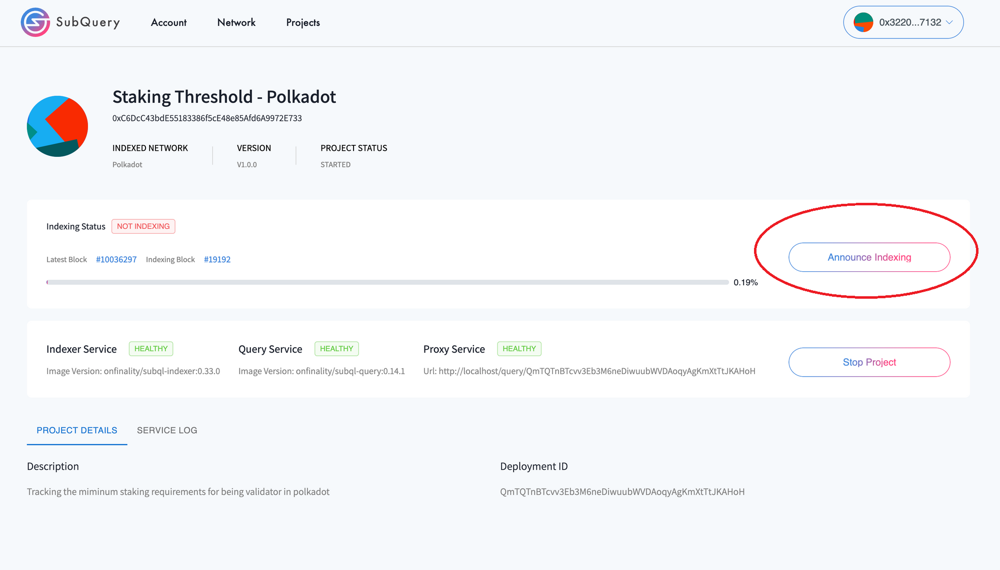

# Initalization

## Connect with MetaMask


```


##Add SubQuery Network


```
Network Name: SQN Testnet
RPC URL: https://sqtn.api.onfinality.io/public
Chain ID: 1280
Currency Symbol: SQN
Block Explorer URL: 


#Request Approve Authorisation


# Stake to Become an Indexer


# Start Synchronising


# Indexer Account Dashboard


## Config Controller


## Update Indexer Metadata


# Projects
## Adding a Project


## Start Indexing Project


## Announce Indexing the Project to the Network




## Announce The Indexing Service is Ready to Use


# Create a default plan


# Create a specific plan 


Specific plan  override a default plan

# Change commission rate


