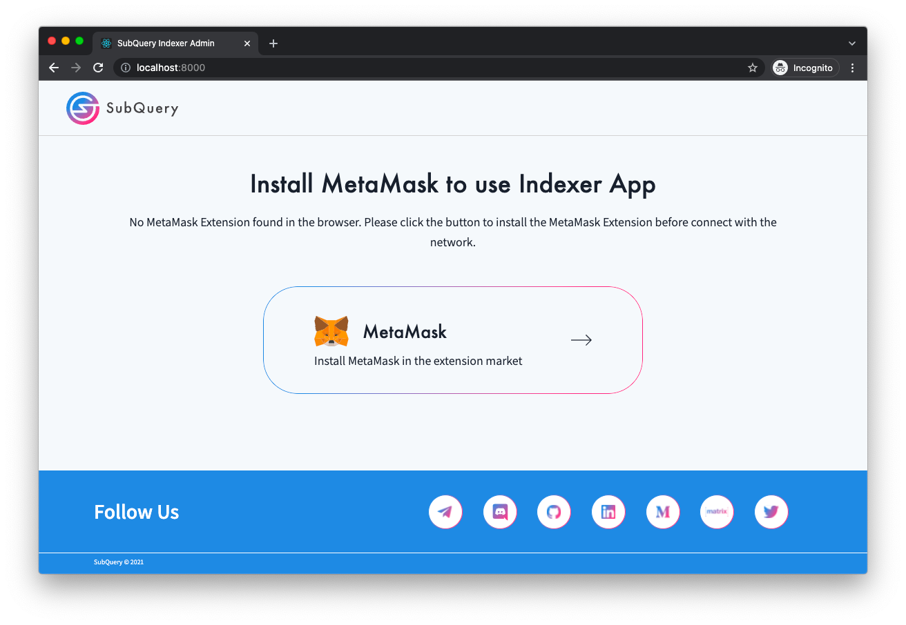
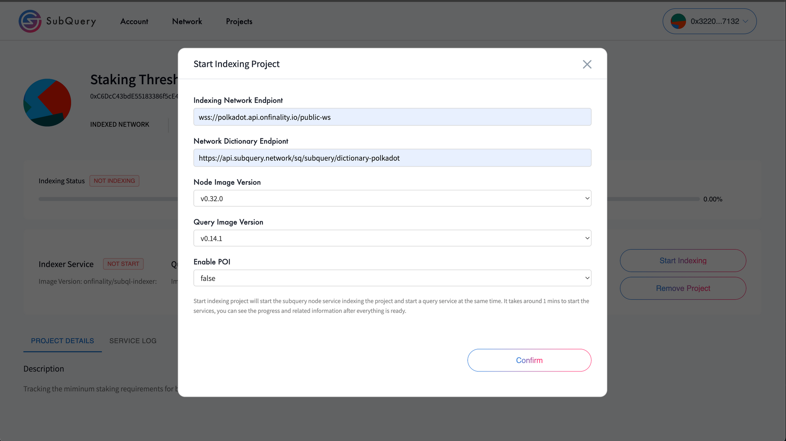

# UI

## Indexer UI
### Auto add network to Metamask did not kick in 
The page got stuck at Connect wallet to use Indesxer App



### Start index project window detail should be displayed in the frontier/project 
- Indexing Network Endpoint
- Network Dictionary Endpoint 



## frontier UI
### Indexer page displaying empty 


### UI not clean


####Plan UI 


#### Purchase a Plan


#### Change commission


# Error 

> [Reported issue 917] (https://github.com/subquery/subql/discussions/917)
```
coordinator_service  | 2022-04-30T21:27:11.534Z <network> ERROR failed to update network: Error: missing revert data in call exception; Transaction reverted without a reason string [ See: https://links.ethers.org/v5-errors-CALL_EXCEPTION ] (error={"reason":"bad response","code":"SERVER_ERROR","status":502,"headers":{"content-type":"text/plain; charset=utf-8","content-length":"93","connection":"close","date":"Sat, 30 Apr 2022 21:27:11 GMT","x-kong-upstream-latency":"5186","x-kong-proxy-latency":"0","via":"kong/2.1.4"},"body":"i/o timeout. The gateway cannot get a response, please try again or contact the administrator","requestBody":"{\"method\":\"eth_call\",\"params\":[{\"from\":\"0x4a92960d1374ea820b79f0ba09c5c7883a5573af\",\"to\":\"0xa500a3ad54223b7e18d7d73da34f2ef06aca77ec\",\"data\":\"0x8d3a2e520000000000000000000000006c0fadd48e7e236bb10f7d69148be5502a18ca57\"},\"latest\"],\"id\":776,\"jsonrpc\":\"2.0\"}","requestMethod":"POST","url":"https://sqtn.api.onfinality.io/public"}, data="0x", code=CALL_EXCEPTION, version=providers/5.6.4)
coordinator_service  | 2022-05-01T02:17:14.317Z <transaction> WARN report project status: FAILED : Error: cannot estimate gas; transaction may fail or may require manual gas limit [ See: https://links.ethers.org/v5-errors-UNPREDICTABLE_GAS_LIMIT ] (error={"reason":"processing response error","code":"SERVER_ERROR","body":"{\"jsonrpc\":\"2.0\",\"error\":{\"code\":-32603,\"message\":\"VM Exception while processing transaction: revert only timestamp that is after previous timestamp is valid\",\"data\":\"08c379a0000000000000000000000000000000000000000000000000000000000000002000000000000000000000000000000000000000000000000000000000000000386f6e6c792074696d657374616d7020746861742069732061667465722070726576696f75732074696d657374616d702069732076616c69640000000000000000\"},\"id\":4095}\n","error":{"code":-32603,"data":"08c379a0000000000000000000000000000000000000000000000000000000000000002000000000000000000000000000000000000000000000000000000000000000386f6e6c792074696d657374616d7020746861742069732061667465722070726576696f75732074696d657374616d702069732076616c69640000000000000000"},"requestBody":"{\"method\":\"eth_estimateGas\",\"params\":[{\"type\":\"0x2\",\"maxFeePerGas\":\"0xd09dc300\",\"maxPriorityFeePerGas\":\"0x59682f00\",\"from\":\"0x4a92960d1374ea820b79f0ba09c5c7883a5573af\",\"to\":\"0xd85888d978e014ad9da7cf011e726b04fbf0c63c\",\"data\":\"0x6b56819d4519820173cfafbe7207d7161675b494071dffa0359db2aaa402efa7379563480000000000000000000000000000000000000000000000000000000000be8c65ab3921276c8067fe0c82def3e5ecfd8447f1961bc85768c2a56e6bd26d3c0c5500000000000000000000000000000000000000000000000000000000626ded90\"}],\"id\":4095,\"jsonrpc\":\"2.0\"}","requestMethod":"POST","url":"https://sqtn.api.onfinality.io/public"}, tx={"data":"0x6b56819d4519820173cfafbe7207d7161675b494071dffa0359db2aaa402efa7379563480000000000000000000000000000000000000000000000000000000000be8c65ab3921276c8067fe0c82def3e5ecfd8447f1961bc85768c2a56e6bd26d3c0c5500000000000000000000000000000000000000000000000000000000626ded90","to":{},"from":"0x4a92960d1374EA820B79f0bA09c5c7883A5573AF","type":2,"maxFeePerGas":{"type":"BigNumber","hex":"0xd09dc300"},"maxPriorityFeePerGas":{"type":"BigNumber","hex":"0x59682f00"},"nonce":{},"gasLimit":{},"chainId":{}}, code=UNPREDICTABLE_GAS_LIMIT, version=abstract-signer/5.6.0)
coordinator_service  | 2022-05-01T02:17:53.685Z <transaction> WARN report project status: FAILED : Error: cannot estimate gas; transaction may fail or may require manual gas limit [ See: https://links.ethers.org/v5-errors-UNPREDICTABLE_GAS_LIMIT ] (error={"reason":"processing response error","code":"SERVER_ERROR","body":"{\"jsonrpc\":\"2.0\",\"error\":{\"code\":-32603,\"message\":\"VM Exception while processing transaction: revert only timestamp that is after previous timestamp is valid\",\"data\":\"08c379a0000000000000000000000000000000000000000000000000000000000000002000000000000000000000000000000000000000000000000000000000000000386f6e6c792074696d657374616d7020746861742069732061667465722070726576696f75732074696d657374616d702069732076616c69640000000000000000\"},\"id\":4125}\n","error":{"code":-32603,"data":"08c379a0000000000000000000000000000000000000000000000000000000000000002000000000000000000000000000000000000000000000000000000000000000386f6e6c792074696d657374616d7020746861742069732061667465722070726576696f75732074696d657374616d702069732076616c69640000000000000000"},"requestBody":"{\"method\":\"eth_estimateGas\",\"params\":[{\"type\":\"0x2\",\"maxFeePerGas\":\"0xd09dc300\",\"maxPriorityFeePerGas\":\"0x59682f00\",\"from\":\"0x4a92960d1374ea820b79f0ba09c5c7883a5573af\",\"to\":\"0xd85888d978e014ad9da7cf011e726b04fbf0c63c\",\"data\":\"0x6b56819d4519820173cfafbe7207d7161675b494071dffa0359db2aaa402efa7379563480000000000000000000000000000000000000000000000000000000000be8c65ab3921276c8067fe0c82def3e5ecfd8447f1961bc85768c2a56e6bd26d3c0c5500000000000000000000000000000000000000000000000000000000626ded90\"}],\"id\":4125,\"jsonrpc\":\"2.0\"}","requestMethod":"POST","url":"https://sqtn.api.onfinality.io/public"}, tx={"data":"0x6b56819d4519820173cfafbe7207d7161675b494071dffa0359db2aaa402efa7379563480000000000000000000000000000000000000000000000000000000000be8c65ab3921276c8067fe0c82def3e5ecfd8447f1961bc85768c2a56e6bd26d3c0c5500000000000000000000000000000000000000000000000000000000626ded90","to":{},"from":"0x4a92960d1374EA820B79f0bA09c5c7883A5573AF","type":2,"maxFeePerGas":{"type":"BigNumber","hex":"0xd09dc300"},"maxPriorityFeePerGas":{"type":"BigNumber","hex":"0x59682f00"},"nonce":{},"gasLimit":{},"chainId":{}}, code=UNPREDICTABLE_GAS_LIMIT, version=abstract-signer/5.6.0)
```


# User Documeentation 
- Create a default plan
- service agreement
- Change commission rate
- Delegated 


# Lack of Metrics visbility 