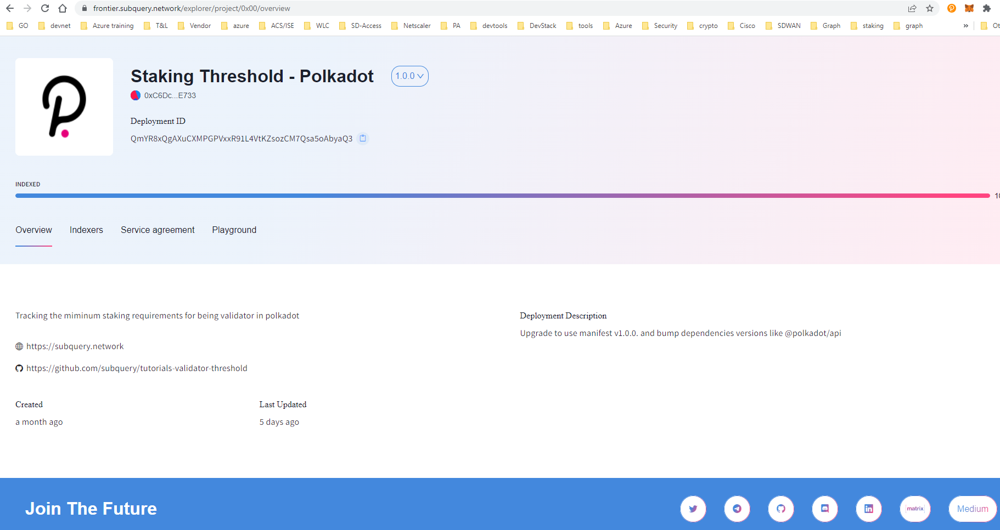
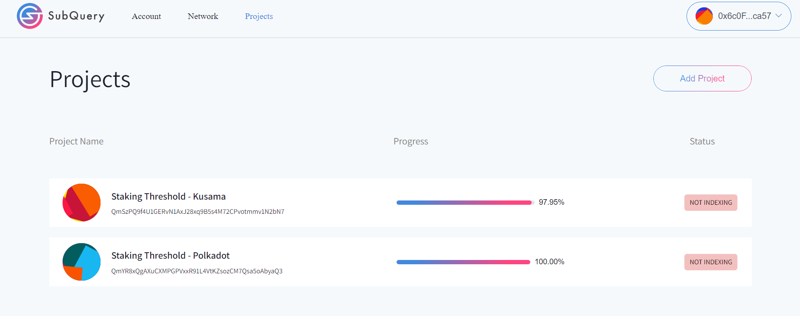
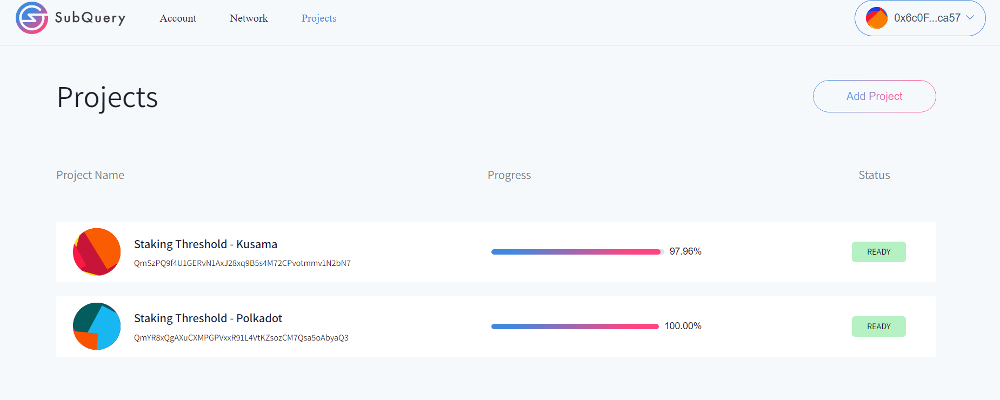
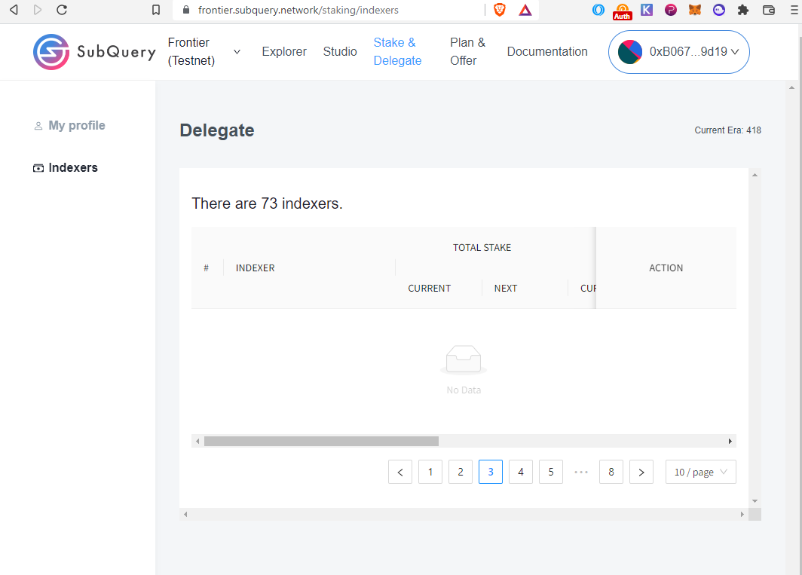
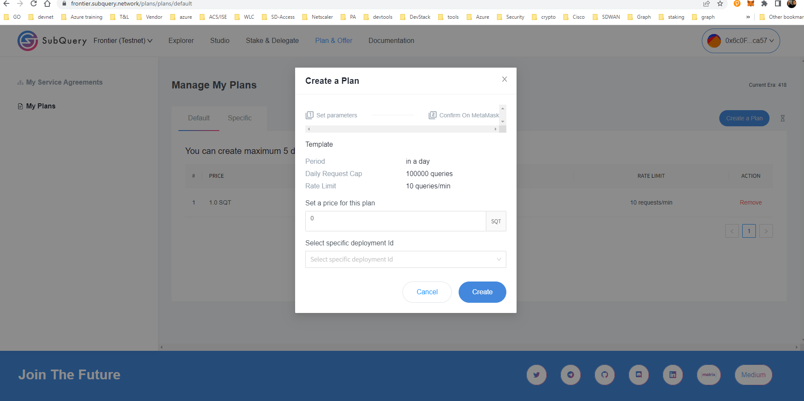
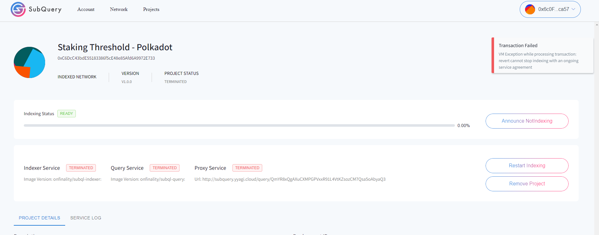
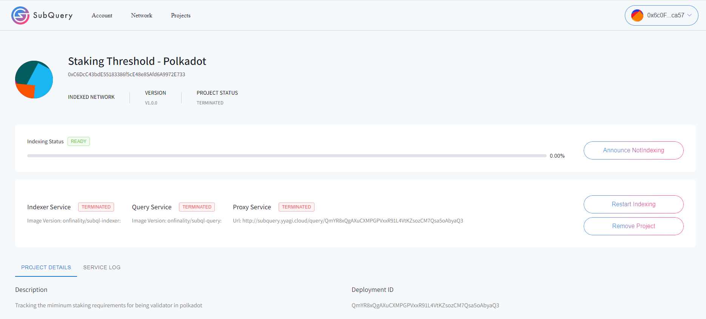
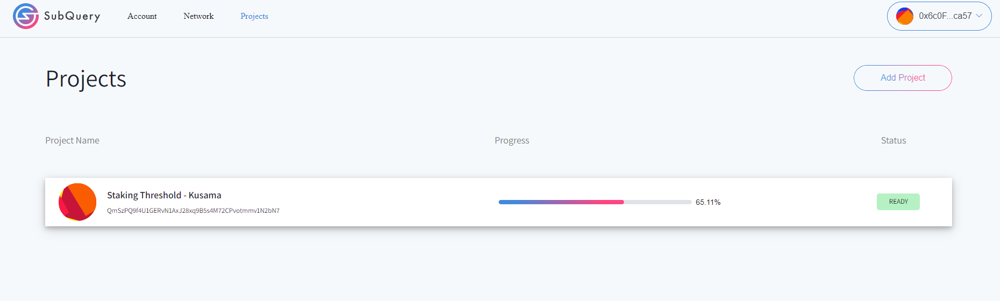
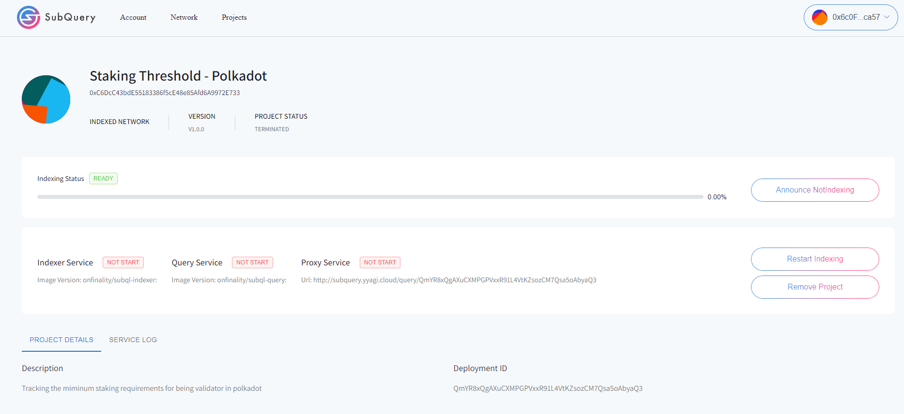

# UI

## Indexer UI
### Auto add network to Metamask did not kick in 

> [Reported issue 966](https://github.com/subquery/subql/discussions/966)
The page got stuck at Connect wallet to use Indesxer App


### Start index project window detail should be displayed in the frontier/project 
- Indexing Network Endpoint
- Network Dictionary Endpoint 




### Indexing status
> [Reported issue 976](https://github.com/subquery/subql/discussions/976)

The indexing status displayed as below even after refreshing the page.

But after browsing into the project and back, it display the below


## frontier UI
### Indexer page displaying empty 

> [Reported issue 967](https://github.com/subquery/subql/discussions/967)


### UI not clean


#### Plan UI 



#### Purchase a Plan


#### Change commission


# Error 1

> [Reported issue 917] (https://github.com/subquery/subql/discussions/917)
```
coordinator_service  | 2022-04-30T21:27:11.534Z <network> ERROR failed to update network: Error: missing revert data in call exception; Transaction reverted without a reason string [ See: https://links.ethers.org/v5-errors-CALL_EXCEPTION ] (error={"reason":"bad response","code":"SERVER_ERROR","status":502,"headers":{"content-type":"text/plain; charset=utf-8","content-length":"93","connection":"close","date":"Sat, 30 Apr 2022 21:27:11 GMT","x-kong-upstream-latency":"5186","x-kong-proxy-latency":"0","via":"kong/2.1.4"},"body":"i/o timeout. The gateway cannot get a response, please try again or contact the administrator","requestBody":"{\"method\":\"eth_call\",\"params\":[{\"from\":\"0x4a92960d1374ea820b79f0ba09c5c7883a5573af\",\"to\":\"0xa500a3ad54223b7e18d7d73da34f2ef06aca77ec\",\"data\":\"0x8d3a2e520000000000000000000000006c0fadd48e7e236bb10f7d69148be5502a18ca57\"},\"latest\"],\"id\":776,\"jsonrpc\":\"2.0\"}","requestMethod":"POST","url":"https://sqtn.api.onfinality.io/public"}, data="0x", code=CALL_EXCEPTION, version=providers/5.6.4)
coordinator_service  | 2022-05-01T02:17:14.317Z <transaction> WARN report project status: FAILED : Error: cannot estimate gas; transaction may fail or may require manual gas limit [ See: https://links.ethers.org/v5-errors-UNPREDICTABLE_GAS_LIMIT ] (error={"reason":"processing response error","code":"SERVER_ERROR","body":"{\"jsonrpc\":\"2.0\",\"error\":{\"code\":-32603,\"message\":\"VM Exception while processing transaction: revert only timestamp that is after previous timestamp is valid\",\"data\":\"08c379a0000000000000000000000000000000000000000000000000000000000000002000000000000000000000000000000000000000000000000000000000000000386f6e6c792074696d657374616d7020746861742069732061667465722070726576696f75732074696d657374616d702069732076616c69640000000000000000\"},\"id\":4095}\n","error":{"code":-32603,"data":"08c379a0000000000000000000000000000000000000000000000000000000000000002000000000000000000000000000000000000000000000000000000000000000386f6e6c792074696d657374616d7020746861742069732061667465722070726576696f75732074696d657374616d702069732076616c69640000000000000000"},"requestBody":"{\"method\":\"eth_estimateGas\",\"params\":[{\"type\":\"0x2\",\"maxFeePerGas\":\"0xd09dc300\",\"maxPriorityFeePerGas\":\"0x59682f00\",\"from\":\"0x4a92960d1374ea820b79f0ba09c5c7883a5573af\",\"to\":\"0xd85888d978e014ad9da7cf011e726b04fbf0c63c\",\"data\":\"0x6b56819d4519820173cfafbe7207d7161675b494071dffa0359db2aaa402efa7379563480000000000000000000000000000000000000000000000000000000000be8c65ab3921276c8067fe0c82def3e5ecfd8447f1961bc85768c2a56e6bd26d3c0c5500000000000000000000000000000000000000000000000000000000626ded90\"}],\"id\":4095,\"jsonrpc\":\"2.0\"}","requestMethod":"POST","url":"https://sqtn.api.onfinality.io/public"}, tx={"data":"0x6b56819d4519820173cfafbe7207d7161675b494071dffa0359db2aaa402efa7379563480000000000000000000000000000000000000000000000000000000000be8c65ab3921276c8067fe0c82def3e5ecfd8447f1961bc85768c2a56e6bd26d3c0c5500000000000000000000000000000000000000000000000000000000626ded90","to":{},"from":"0x4a92960d1374EA820B79f0bA09c5c7883A5573AF","type":2,"maxFeePerGas":{"type":"BigNumber","hex":"0xd09dc300"},"maxPriorityFeePerGas":{"type":"BigNumber","hex":"0x59682f00"},"nonce":{},"gasLimit":{},"chainId":{}}, code=UNPREDICTABLE_GAS_LIMIT, version=abstract-signer/5.6.0)
coordinator_service  | 2022-05-01T02:17:53.685Z <transaction> WARN report project status: FAILED : Error: cannot estimate gas; transaction may fail or may require manual gas limit [ See: https://links.ethers.org/v5-errors-UNPREDICTABLE_GAS_LIMIT ] (error={"reason":"processing response error","code":"SERVER_ERROR","body":"{\"jsonrpc\":\"2.0\",\"error\":{\"code\":-32603,\"message\":\"VM Exception while processing transaction: revert only timestamp that is after previous timestamp is valid\",\"data\":\"08c379a0000000000000000000000000000000000000000000000000000000000000002000000000000000000000000000000000000000000000000000000000000000386f6e6c792074696d657374616d7020746861742069732061667465722070726576696f75732074696d657374616d702069732076616c69640000000000000000\"},\"id\":4125}\n","error":{"code":-32603,"data":"08c379a0000000000000000000000000000000000000000000000000000000000000002000000000000000000000000000000000000000000000000000000000000000386f6e6c792074696d657374616d7020746861742069732061667465722070726576696f75732074696d657374616d702069732076616c69640000000000000000"},"requestBody":"{\"method\":\"eth_estimateGas\",\"params\":[{\"type\":\"0x2\",\"maxFeePerGas\":\"0xd09dc300\",\"maxPriorityFeePerGas\":\"0x59682f00\",\"from\":\"0x4a92960d1374ea820b79f0ba09c5c7883a5573af\",\"to\":\"0xd85888d978e014ad9da7cf011e726b04fbf0c63c\",\"data\":\"0x6b56819d4519820173cfafbe7207d7161675b494071dffa0359db2aaa402efa7379563480000000000000000000000000000000000000000000000000000000000be8c65ab3921276c8067fe0c82def3e5ecfd8447f1961bc85768c2a56e6bd26d3c0c5500000000000000000000000000000000000000000000000000000000626ded90\"}],\"id\":4125,\"jsonrpc\":\"2.0\"}","requestMethod":"POST","url":"https://sqtn.api.onfinality.io/public"}, tx={"data":"0x6b56819d4519820173cfafbe7207d7161675b494071dffa0359db2aaa402efa7379563480000000000000000000000000000000000000000000000000000000000be8c65ab3921276c8067fe0c82def3e5ecfd8447f1961bc85768c2a56e6bd26d3c0c5500000000000000000000000000000000000000000000000000000000626ded90","to":{},"from":"0x4a92960d1374EA820B79f0bA09c5c7883A5573AF","type":2,"maxFeePerGas":{"type":"BigNumber","hex":"0xd09dc300"},"maxPriorityFeePerGas":{"type":"BigNumber","hex":"0x59682f00"},"nonce":{},"gasLimit":{},"chainId":{}}, code=UNPREDICTABLE_GAS_LIMIT, version=abstract-signer/5.6.0)
```

# Error 2: Stop indexing and remove a project while having a custome agreement 


When trying to stop indexing a project with a customer agreement active, I get the error below. 
Also the GUI become a bit confusing. So it reject the request and does not go on chain, but then the remove project works and the project disappear but when you add the project back it comes with the same state before removal.

> [Reported issue 65](https://github.com/subquery/subql/discussions/965)
```
coordinator_proxy    | unhandled error: Rejection(QueryError("error sending request for url (http://query_qmyr8xqgaxucxmp:3001/): error trying to connect: dns error: failed to lookup address information: Temporary failure in name resolution"))
coordinator_proxy    | unhandled error: Rejection(QueryError("error sending request for url (http://query_qmyr8xqgaxucxmp:3001/): error trying to connect: dns error: failed to lookup address information: Temporary failure in name resolution"))
coordinator_proxy    | unhandled error: Rejection(QueryError("error sending request for url (http://query_qmyr8xqgaxucxmp:3001/): error trying to connect: dns error: failed to lookup address information: Temporary failure in name resolution"))
coordinator_db       | 2022-05-04 03:12:46.162 UTC [2885] LOG:  unexpected EOF on client connection with an open transaction
```







# User Documeentation 
- Create a default plan
- service agreement
- Change commission rate
- Delegated 


# Lack of Metrics visbility 
