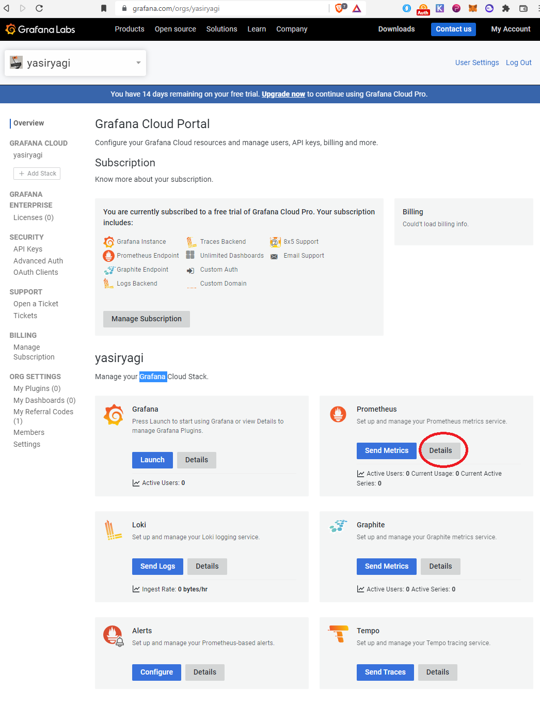
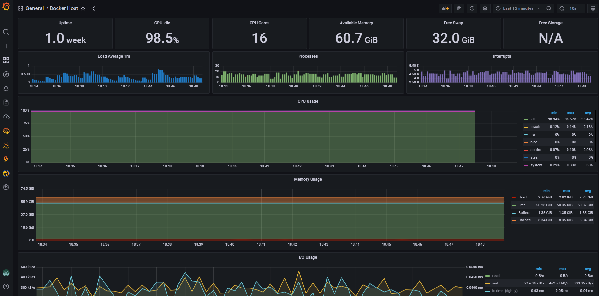
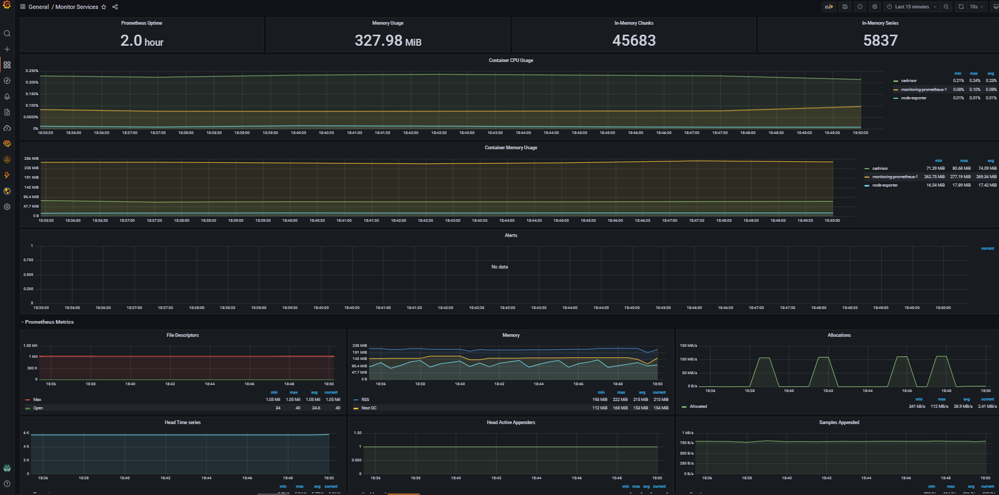

# Subquery Docker

## Requirements 

apt install -y vim htop ca-certificates curl gnupg lsb-release
 

## Install docker

```
apt-get update
curl -fsSL https://download.docker.com/linux/ubuntu/gpg | sudo gpg --dearmor -o /usr/share/keyrings/docker-archive-keyring.gpg
echo \
  "deb [arch=$(dpkg --print-architecture) signed-by=/usr/share/keyrings/docker-archive-keyring.gpg] https://download.docker.com/linux/ubuntu \
  $(lsb_release -cs) stable" | sudo tee /etc/apt/sources.list.d/docker.list > /dev/null
apt-get update
apt-get install docker-ce docker-ce-cli containerd.io docker-compose-plugin
```

## Install docker-compose
```
curl -L https://github.com/docker/compose/releases/download/v2.5.0/docker-compose-linux-x86_64 -o /usr/local/bin/docker-compose
chmod +x /usr/local/bin/docker-compose
```


## Firewall

```
cp firewall/after.rules /etc/ufw/after.rules
ufw allow ssh
ufw route allow proto tcp from any to any port 80
ufw route allow proto tcp from 208.127.54.8 to any port 8000
ufw route allow proto tcp from any to any port 3001
ufw route allow proto tcp from any to any port 3002
ufw enable 
```

## Run as a service


```
get clone https://github.com/yasiryagi/SubQuery.git
curl https://raw.githubusercontent.com/subquery/indexer-services/main/docker-compose.yml -o docker-compose.yml
cp service/subquery.service /etc/systemd/system/subquery.service
systemctl start subquery.service
systemctl status subquery.service
docker ps
docker-compose logs -f --tail 100
```

## Ref
> https://www.notion.so/subquery/Running-Indexer-Services-3a46ea8c0e0441529645216c16efd75f


# Monitoring 

```
cp service/monitor_subquery.service /etc/systemd/system/monitor_subquery.service
systemctl start monitor_subquery.service
systemctl status monitor_subquery.service
docker ps
docker-compose logs -f --tail 100
```

## Upgrade 

## Upgrade SubQuery
cd SubQuery/

```
docker-compose pull
docker-compose down proxy-server service1 service2 
docker-compose build proxy-server service1 service2
docker-compose up -d proxy-server service1 service2
```

Example
``` 
docker-compose pull
docker-compose down proxy-server coordinator-service
docker-compose build proxy-server coordinator-service
docker-compose up -d proxy-server coordinator-service
```

## Grafana 

We will be using cloud grafana.
> [create an account](https://grafana.com/)


Click on the detail button to get your details to be used in the Prometheus config



### Get and install dashboard templates 


Import the dashboard from [here](./monitoring/node-exporter-full_rev27.json) or download it from [Node Exporter Dashboard](https://grafana.com/grafana/dashboards/1860)




## Ref
> https://grafana.com/orgs/**<username>**
> https://grafana.com/docs/grafana-cloud/quickstart/docker-compose-linux/


