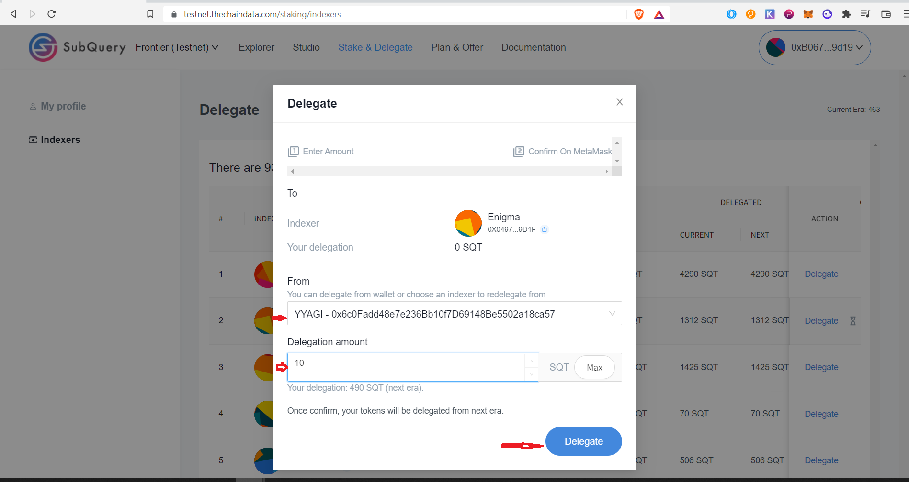

# Index completely your first project (10 points)

# Index completely your second project (50 points)

# Create a default plan (50 points)

# Override a default plan (50 points)

# Get a service agreement from consumer (50 points)

# Staking operations

## Change commission rate (10 points)

##  Be delegated by a different account (20 points)

# At the end of season 2, provide useful feedback and node metrics to the SubQuery Team via GitHub Discussions (200 points)

# Delegator operations
## Redelegate tokens between accounts

